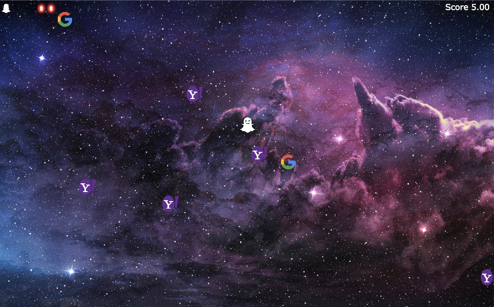

## IPO Defender

[Live Link](https://jstuff36.github.io/ipo_defender/)

 ### Background

 In IPO Defender, you are Ghostface Chillah protecting the universe from the acquisition attempts of the tech giants originating from the silicon nebula. Three of the tech giants have banded together in an attempt to overwhelm your tiny ship, but fear not for you have a steady supply of ammunition plus three bombs!

The tech giants will come in waves and for each that you repel a larger more formidable one will take its place so keep up your guard!

If you happen to collide with a tech giant three times your energy reserves will be depleted and you will have been acquired, but fear not! There is great treasure to be gained for if you survive through 5 waves, you will not only save the universe, but you will also collect enough treasurer for your war chest to starve off acquisitions forever!



### Controls

- Movement is controlled by the WASD keys
- Firing is achieved by using the arrow keys
- Bombs are activated by pressing the spacebar

### Enemies

Enemies enter the screen from the one of the four corners and behave as described below:

- Wanderers aimlessly move about the map bouncing of off boundaries as expected.

- Grunts relentlessly track the ships position with the goal of colliding with it

- Weavers behave as the grunts with the addition that they have the ability to perceive bullets and avoid them

 This app will be a single page app consisting of a game board, game controls, and nav links to the Github and my LinkedIn. Game controls will consist of the ability to move the ship in 8 directions with the keys a (left), s (down), w (up), and d (right), the ability to shoot in 8 direction with the keys 4 arrow keys, and release bombs by pressing the space bar.

### Architecture and Technologies

 This project was implemented using

 - Vanilla JavaScript for overall structure and game logic,
 - `HTML5 Canvas` for DOM manipulation and rendering
 - Webpack to bundle and serve up the various scripts.

### Technicalities

  In this project Javascript's OOP capabilites were utilized in order to create DRY, maintainable, and scalable code. As most of the game logic deals with moving pieces (ship, enemies, and bullets) the class `moving_object` was created which all other moving pieces could inherit from. In doing logic common across all moving pieces could be implemented. A short example seen below is the collideWith function which checks if one moving object has collided with another.

```javascript
  isCollideWith(otherObject) {
    const centerDist = Util.dist(this.pos, otherObject.pos);
    return (this.radius + otherObject.radius > centerDist);
  }
```

### Bonus Features

 - [ ] Additional enemies such as the black hole
 - [ ] different types of bullets
