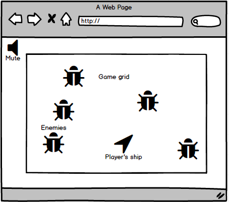

## IPO Defender

 ### Background

 In IPO Defender, you are Ghostface Chillah protecting the universe from the acquisition attempts of the tech giants originating from the silicon nebula. Three of the tech giants have banded together in an attempt to overwhelm your tiny ship, but fear not for you have a steady supply of ammunition plus three bombs!

The tech giants will come in waves and for each that you repel a larger more formidable one will take its place so keep up your guard!

If you happen to collide with a tech giant three times your energy reserves will be depleted and you will have been acquired, but fear not! There is great treasure to be gained for if you survive through 5 waves, you will not only save the universe, but you will also collect enough treasurer for your war chest to starve off acquisitions forever!

 ### Functionality & MVP

 In this version of Geometry Wars, the game will include:

 - [ ] Ability to control ship and shoot in desired direction
 - [ ] Enemies spawn at random and target the ship
 - [ ] Ability to use bombs
 - [ ] Multiple enemies

 In addition, this project will include:

 - [ ] A production ReadMe

 ### Wireframes

 This app will be a single page app consisting of a game board, game controls, and nav links to the Github and my LinkedIn. Game controls will consist of the ability to move the ship in 8 directions with the keys a (left), s (down), w (up), and d (right), the ability to shoot in 8 direction with the keys 4 arrow keys, and release bombs by pressing the space bar.

 

 ### Architecture and Technologies

 This project will be implemented with the following technologies:

 - Vanilla JavaScript and `jquery` for overall structure and game logic,
 - `Easel.js` with `HTML5 Canvas` for DOM manipulation and rendering,
 - Webpack to bundle and serve up the various scripts.

 Additionally, various scripts will be involved in this project including:

 `enemy.js` which will handle the logic common among all enemies
 `wanderer.js`  this enemy has no special abilities. It simply moves arbitrarily around the playing field at slow speeds.
 `weaver.js` this enemy has the ability to actively "dodge" incoming bullets.
 `grunt.js` this enemy is the most common enemy that will spawn. It simply moves straight toward the player
 `player.js` which will handle the logic unique to the player's ship
 `bullets.js` which will handle the logic unique to the all bullets and be the default bullets
 `bombs.js` which will handle the bomb logic for the players ship
 `ship.js` handles the logic for the players ship
 `board.js` this script will handle the logic necessary for creating enemies and placing them on the board

 ### Implementation Timeline

 **Day 1**: Setup all necessary Node modules, including getting webpack working and `Easel.js` installed. Goals for the day:

 - Get a green bundle for webpack
 - Setup ability to render ship and move it around

 **Day 2**: Finish setting up ship logic including ability to shoot bullets. Move onto enemy classes. Goals for the day:

 - Ship can move around and fire bullets in 8 directions
 - Finishes basic enemy logic

 **Day 3**: Move on to logic specific to each enemy. Goals for the day:

 - Finish grunt and wanderer enemies
 - Start on bare bones of weaver enemy

 **Day 4**: Finish weaver enemy and create bomb logic. Style game and make it look nice. Goals for the day:

 - All enemies finished
 - Player can launch a bomb to destroy all enemies on board
 - Lots of styling

 ### Bonus Features

 - [ ] Additional enemies such as the black hole
 - [ ] different types of bullets
